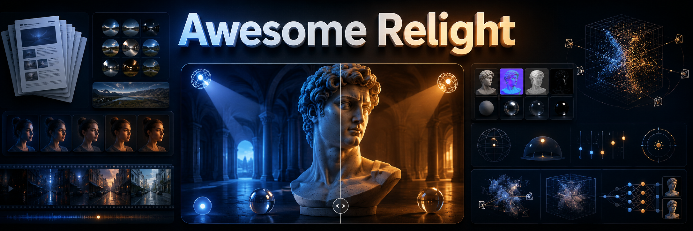

<div align="center">

# 💡 Awesome Relight

[](https://awesome.re)
[](LICENSE)
[](CONTRIBUTING.md)
[](#)

**A curated map of relighting research, datasets, benchmarks, demos, and software across image editing, video, 3D, avatars, inverse rendering, lighting estimation, and generative models.**

<p align="center">
  
</p>

</div>

---

## 🚩 News & Updates

🆕 **[2026-08-21] August Relighting Update** — Added the latest public results from the August 2026 sweep: **FusionRelight** for real-time portrait relighting through hybrid physics/OLAT/in-the-wild distillation, and a focused analysis of **HorizonRelight** and **ALI**. The current frontier is converging on explicit physical supervision for fidelity, plus latent-domain conditioning and self-conditioning for long-horizon temporal stability.

🆕 **[2026-08-07] Latest Relighting Sweep** — Added LiveLight for real-time, indefinitely streaming video relighting; IRGS++ for robust inter-reflective Gaussian inverse rendering; PanoLess for recovering illumination from partial reflective views; FreeShadow and WildShadowRemover for training-free image and in-the-wild video shadow removal; DecoupleGS for relit interactive driving-scene simulation; physics-grounded agentic shadow editing; and PRISM for spatially gated unpaired day-to-night translation.

🆕 **[2026-07-24] Latest Relighting Sweep** — Added Consistent Feature Transport (CFT) for content-preserving image relighting, FF-ProCams for feed-forward relightable projector-camera scenes, FIDE for black-box inverse rendering, Lumera/Lumera-2K for engine-native light-aware scene reconstruction, and scene-parameter saliency through differentiable light transport.

🆕 **[2026-07-17] Latest Relighting Sweep** — Added FreeLit and Lume-Palette for controllable indoor relighting, dynamic inverse rendering from moving-object video, VibeFlow for video chroma-lux editing, SpectralSplat for appearance-disentangled driving scenes, Olbedo for large-scale outdoor intrinsic decomposition, and recent inverse-rendering work on surface splatting, rotated lights, cross-view intrinsic consistency, and subsurface scattering.

🆕 **[2026-07-10] Latest Relighting Sweep** — Added LightCrafter for PBR-conditioned, temporally consistent video relighting and V-LITE for dynamic HDR lighting estimation from in-the-wild video, together with the newly introduced V-LITESet dataset.

🆕 **[2026-07-03] Latest Relighting Sweep** — Added newly surfaced work on long-horizon video relighting, feed-forward inverse scene splatting, relightable/deformable Gaussian assets, hybrid path-traced Gaussian relighting, PBR/material priors for relighting, albedo neural texturing, relightable monocular avatars, and urban multi-illumination datasets.

🆕 **[2026-06-27] Latest Relighting Sweep** — Added newly surfaced work on generative relightable avatars, renderer-grounded lighting control for video generation, cinematic character-environment lighting harmonization, human material estimation for downstream relighting, and neural material extraction.

🆕 **[2026-06-20] Recent Relighting Refresh** — Added recent 2025-2026 work on physically controllable image relighting, video relighting, portrait and human relighting, relightable Gaussian/3D scenes, and new datasets/benchmarks.

🔥 **[Ongoing] Coverage Expansion** — We are tracking relighting papers, datasets, code, demos, challenges, and production tools.

💡 **[Ongoing] Contributions Welcome** — Missing recent work, code releases, datasets, and software links are welcome via PR. See [CONTRIBUTING.md](CONTRIBUTING.md).

---

## Overview

- 🎯 [Aim of the Project](#aim-of-the-project)
- 📚 [Surveys](#surveys)
- 🧭 [Recent Research Map (2025-2026)](#recent-research-map-2025-2026)
- 🖼️ [Scene and General Image Relighting](#scene-and-general-image-relighting)
- 🎞️ [Video Relighting](#video-relighting)
- 🧑 [Portrait, Face, and Human Relighting](#portrait-face-and-human-relighting)
- 🧊 [3D, NeRF, Gaussian, and Object Relighting](#3d-nerf-gaussian-and-object-relighting)
- 🚗 [Relighting for Driving and Robotics](#relighting-for-driving-and-robotics)
- 🛡️ [Security and Robustness](#security-and-robustness)
- 🎮 [Reinforcement Learning](#reinforcement-learning)
- 📦 [Datasets and Benchmarks](#datasets-and-benchmarks)
- 🏁 [Workshops and Challenges](#workshops-and-challenges)
- 🛠️ [Software, Demos, and Products](#software-demos-and-products)
- 🔭 [Related Areas](#related-areas)
- 🙏 [Acknowledgements](#acknowledgements)
- 📝 [Citation](#citation)

---

## Aim of the Project

Relighting is a practical meeting point between computer graphics, computer vision, inverse rendering, neural rendering, diffusion models, portrait editing, video generation, and 3D reconstruction. This repository aims to:

- 🔍 **Organize** relighting work by task and representation, instead of only by publication date.
- 🧭 **Map** the field from classical illumination estimation to modern generative lighting control.
- 🛠️ **Track** papers together with project pages, code, demos, datasets, and software products.
- 🤝 **Help** researchers and builders find relevant methods for portraits, objects, scenes, videos, avatars, and driving data.
- 📌 **Maintain** a clean awesome-list format that is easy to scan and easy to extend.

---

## Surveys

- **Deep Neural Models for Illumination Estimation and Relighting: A Survey**. [](https://onlinelibrary.wiley.com/doi/epdf/10.1111/cgf.14283)

---

## Recent Research Map (2025-2026)

Recent relighting work is rapidly splitting into several complementary tracks:

- **Physically controllable single-image relighting** is moving beyond text-only or environment-map-only control toward explicit 3D/PBR handles and content-preserving illumination transport. Representative work includes [Physically Controllable Relighting of Photographs](https://arxiv.org/abs/2508.05626), [Learning Latent Proxies for Controllable Single-Image Relighting](https://arxiv.org/abs/2603.15555), [PI-Light](https://arxiv.org/abs/2601.22135), [TokenLight](https://arxiv.org/abs/2604.15310), [Learning Illumination Control in Diffusion Models](https://arxiv.org/abs/2604.24877), [PIXLRelight](https://arxiv.org/abs/2605.18735), [WarpI2I](https://arxiv.org/abs/2606.31018), [FreeLit](https://arxiv.org/abs/2607.13656), and [Consistent Feature Transport](https://arxiv.org/abs/2607.17833). The common trend is to recover or synthesize intrinsic/PBR-style control signals first, then use a neural renderer or diffusion/flow prior for photorealism. FreeLit removes the need for paired multi-illumination training data through physics-guided pseudo-relighting and intrinsic stabilization, while CFT explicitly supervises source-to-target feature trajectories to change illumination without drifting identity or geometry.
- **Video relighting** has become a major 2025-2026 frontier. Methods such as [RelightVid](https://arxiv.org/abs/2501.16330), [UniRelight](https://arxiv.org/abs/2506.15673), [Lumen](https://arxiv.org/abs/2508.12945), [ReLumix](https://arxiv.org/abs/2509.23769), [UniLumos](https://arxiv.org/abs/2511.01678), [RelightMaster](https://arxiv.org/abs/2511.06271), [FlowPortal](https://arxiv.org/abs/2511.18346), [Hi-Light](https://arxiv.org/abs/2601.23167), [Light4D](https://arxiv.org/abs/2602.11769), [CamLit](https://arxiv.org/abs/2603.14241), [LightCtrl](https://arxiv.org/abs/2603.27083), [LiVER](https://arxiv.org/abs/2604.07966), [Relit-LiVE](https://arxiv.org/abs/2605.06658), [BodyReLux](https://arxiv.org/abs/2605.21766), [HarmoVid](https://arxiv.org/abs/2605.28811), [Pixel Cube](https://arxiv.org/abs/2606.02919), [Cinematic Compositing](https://arxiv.org/abs/2606.20233), [HorizonRelight](https://arxiv.org/abs/2606.29095), [LightCrafter](https://arxiv.org/abs/2607.08016), and [LiveLight](https://arxiv.org/abs/2608.01771) focus on temporal coherence, explicit light trajectories, dynamic environment maps, camera-aware control, long-horizon continuity, and production-quality foreground/background harmonization. LightCrafter is a particularly clear example of the emerging hybrid direction: it first renders a physically grounded PBR proxy under the target illumination, then uses a video diffusion model to restore effects that are difficult to model explicitly, such as global illumination. LiveLight pushes the efficiency frontier further with multi-plane light-irradiance conditioning, geometry-guided low-NFE distillation, and a rolling denoising window for interactive, arbitrarily long streaming. **HorizonRelight** specifically reframes long-horizon inference as latent-domain translation: propagated target latents, masked target self-conditioning, and a warm-start relit anchor reduce chunk-boundary discontinuities without requiring a long-clip backbone.
- **Relightable 3D Gaussian and neural scene representations** are expanding from object-scale reconstruction into outdoor scenes, room-scale environments, virtual production, urban simulation, and active projection. Recent directions include [R3GW](https://arxiv.org/abs/2603.02801), [ReLi3D](https://arxiv.org/abs/2603.19753), [SSD-GS](https://arxiv.org/abs/2604.13333), [SeasonScapes](https://arxiv.org/abs/2605.09039), [Relightable Gaussian Splatting for Virtual Production](https://arxiv.org/abs/2605.09024), [F-RNG](https://arxiv.org/abs/2605.25975), [SRUG](https://arxiv.org/abs/2605.24700), [MaterialClusterGS](https://arxiv.org/abs/2606.09018), [TRON](https://arxiv.org/abs/2606.11314), [BRDFusion](https://arxiv.org/abs/2606.17049), [AEGIR](https://arxiv.org/abs/2606.28635), [DR-GS](https://arxiv.org/abs/2606.29379), [DANTE-W](https://arxiv.org/abs/2606.30677), [InvSplat](https://arxiv.org/abs/2607.02301), [Lume-Palette](https://arxiv.org/abs/2607.08879), [Dynamic Inverse Rendering](https://arxiv.org/abs/2607.09329), [FF-ProCams](https://arxiv.org/abs/2607.17803), and [IRGS++](https://arxiv.org/abs/2607.22780). The field is increasingly mixing explicit light transport, material priors, ray/path tracing, generative neural renderers, and multi-view or motion cues that reduce material-light ambiguity; FF-ProCams extends this direction to feed-forward recovery of relightable Gaussians under arbitrary projector illumination, while IRGS++ explicitly handles inter-reflection and metallic/glossy materials with a full transport model and accelerated secondary-ray queries.
- **Portrait, face, and human relighting** is shifting toward calibrated data, relightable avatars, and dynamic human performance. New representative work includes [3DPR](https://arxiv.org/abs/2510.15846), [KPLM-STA](https://arxiv.org/abs/2511.08169), [POLAR](https://arxiv.org/abs/2512.13192), [Light Up Your Face](https://arxiv.org/abs/2602.04300), [FusionRelight](https://arxiv.org/abs/2604.23094), [OpenDelight](https://arxiv.org/abs/2605.05636), [HAFMat](https://arxiv.org/abs/2606.16323), [EgoRelight](https://arxiv.org/abs/2605.28401), [Generative Relightable Avatars](https://arxiv.org/abs/2606.22718), [Monocular Avatar Reconstruction via Cascaded Diffusion Priors](https://arxiv.org/abs/2606.28144), [BodyReLux](https://arxiv.org/abs/2605.21766), and [Pixel Cube](https://arxiv.org/abs/2606.02919). **FusionRelight** is notable for hybrid domain-knowledge fusion: synthetic RGB/albedo/normal supervision, OLAT captures, and in-the-wild data are source-routed into a compact deterministic student, reaching 11.89 ms at 512x512 on an RTX 2060 (1.82 ms on an RTX 4090).
- **Datasets and benchmarks** are becoming more important because diffusion relighting often looks convincing on synthetic tests while failing under real lighting, geometry, and camera response. Recent datasets include [HumanOLAT](https://arxiv.org/abs/2508.09137), [OLATverse](https://arxiv.org/abs/2511.02483), [POLAR](https://arxiv.org/abs/2512.13192), [Light Up Your Face](https://arxiv.org/abs/2602.04300), [LightCity](https://arxiv.org/abs/2602.01118), [WildRelight](https://arxiv.org/abs/2605.11696), [SeasonScapes](https://arxiv.org/abs/2605.09039), the portrait relighting data introduced with [CFT](https://arxiv.org/abs/2607.17833), the synthetic active-illumination data from [FF-ProCams](https://arxiv.org/abs/2607.17803), the engine-native [Lumera-2K](https://arxiv.org/abs/2607.20889) benchmark, [WildShadow](https://arxiv.org/abs/2607.26203) for paired video shadow removal, and [Shiny Partial](https://vb-glee.github.io/panoless/) for illumination recovery from partial reflective views.
- **Dynamic lighting estimation** is increasingly being treated as a video-generation problem rather than frame-wise panorama regression. [V-LITE](https://arxiv.org/abs/2607.04674) turns a video diffusion model into an HDR lighting estimator by asking it to inpaint a virtual chrome ball, then unprojects the temporally coherent reflections into dynamic environment maps. This closes an important loop between lighting estimation, virtual-object insertion, and downstream relighting.
- **General inverse rendering and editable-light reconstruction** are also broadening the relighting toolbox. [FIDE](https://arxiv.org/abs/2607.17411) treats any renderer as a black box and combines dense ViT feature guidance, diffusion proposals, and evolutionary refinement; [Lumera](https://arxiv.org/abs/2607.20889) reconstructs engine-native objects and parametric lights from a single image and introduces the Lumera-2K benchmark; and [Scene Parameter Saliency](https://arxiv.org/abs/2607.21562) uses a single reverse-mode light-transport pass to identify which geometry, material, and lighting parameters most affect a chosen image metric.
- **Shadow editing and illumination transfer** are increasingly borrowing controllability mechanisms from general-purpose generative models while retaining physical constraints. [FreeShadow](https://arxiv.org/abs/2607.26715) transfers illumination cues from non-shadow regions inside a frozen diffusion model, [WildShadowRemover](https://arxiv.org/abs/2607.26203) combines video diffusion with detail injection, frequency-decomposed modulation, and monocular depth, and [Domain-Grounded Candidate Selection](https://arxiv.org/abs/2608.06075) uses shadow-formation physics to guide and screen candidates from a commercial image editor. [PRISM](https://arxiv.org/abs/2608.06240) explores a complementary unpaired-translation direction, learning per-feature gates that decide what to preserve or transport and evaluating the design on day-to-night relighting among five domains.

In short: diffusion models are providing photorealistic priors, but the strongest recent systems are reintroducing explicit lighting, geometry, material, or OLAT structure to make relighting controllable, temporally stable, and useful for real production pipelines.

---

## Scene and General Image Relighting

- **Learning to Factorize and Relight a City**. [](https://arxiv.org/abs/2008.02796)
- **Self-supervised Outdoor Scene Relighting**. [](https://arxiv.org/abs/2107.03106) [](https://github.com/YeeU/relightingNet)
- **OutCast: Outdoor Single-image Relighting with Cast Shadows**. [](https://arxiv.org/abs/2204.09341)
- **StyLitGAN: Image-Based Relighting via Latent Control**. [](https://openaccess.thecvf.com/content/CVPR2024/papers/Bhattad_StyLitGAN_Image-Based_Relighting_via_Latent_Control_CVPR_2024_paper.pdf) [](https://github.com/anandbhattad/stylitgan)
- **PNRNet: Physically-Inspired Neural Rendering for Any-to-Any Relighting**. [](https://ieeexplore.ieee.org/document/9785513) [](https://github.com/waldenlakes/PNRNet)
- **Local Relighting of Real Scenes**. [](https://arxiv.org/abs/2207.02774) [](https://github.com/audreycui/relighting)
- **Designing an Illumination-Aware Network for Deep Image Relighting**. [](https://arxiv.org/abs/2207.10582) [](https://github.com/NK-CS-ZZL/IAN)
- **Weakly-supervised Single-view Image Relighting**. [](https://arxiv.org/abs/2303.13852) [](https://github.com/renjiaoyi/imagerelighting)
- **Intrinsic Image Diffusion for Single-view Material Estimation**. [](https://arxiv.org/abs/2312.12274) [](https://peter-kocsis.github.io/IntrinsicImageDiffusion/) [](https://github.com/Peter-Kocsis/IntrinsicImageDiffusion)
- **IRIS: Inverse Rendering of Indoor Scenes from Low Dynamic Range Images**. [](https://arxiv.org/abs/2401.12977) [](https://irisldr.github.io/) [](https://github.com/facebookresearch/iris)
- **DiLightNet: Fine-grained Lighting Control for Diffusion-based Image Generation**. [](https://arxiv.org/abs/2402.11929) [](https://github.com/iamNCJ/DiLightNet)
- **LightIt: Illumination Modeling and Control for Diffusion Models**. [](https://arxiv.org/abs/2403.10615)
- **RGB↔X: Image Decomposition and Synthesis Using Material- and Lighting-aware Diffusion Models**. [](https://arxiv.org/abs/2405.00666) [](https://zheng95z.github.io/publications/rgbx24) [](https://github.com/zheng95z/rgbx)
- **Scaling In-the-Wild Training for Diffusion-based Illumination Harmonization and Editing**. [](https://openreview.net/forum?id=u1cQYxRI1H) [](https://github.com/lllyasviel/IC-Light)
- **Latent Intrinsics Emerge from Training to Relight**. [](https://arxiv.org/abs/2405.21074) [](https://github.com/xyxingx/LumiNet)
- **Relighting from a Single Image: Datasets and Deep Intrinsic-based Architecture**. [](https://arxiv.org/abs/2409.18770) [](https://github.com/CVC-CIC/DeepIntrinsicRelighting)
- **Noise Crystallization and Liquid Noise: Zero-shot Video Generation using Image Diffusion Models**. [](https://arxiv.org/abs/2410.05322) [](https://github.com/Strikewind/LiquidNoise)
- **Diffusion Self-Distillation for Zero-Shot Customized Image Generation**. [](https://arxiv.org/abs/2411.18616) [](https://primecai.github.io/dsd/) [](https://huggingface.co/spaces/primecai/diffusion-self-distillation) [](https://github.com/primecai/diffusion-self-distillation)
- **ScribbleLight: Single Image Indoor Relighting with Scribbles**. [](https://arxiv.org/abs/2411.17696) [](https://github.com/chedgekorea/scriblit)
- **LumiNet: Latent Intrinsics Meets Diffusion Models for Indoor Scene Relighting**. [](https://arxiv.org/abs/2412.00177) [](https://github.com/xyxingx/LumiNet)
- **LuminaBrush: Illumination Drawing Tools for Text-to-Image Diffusion Models**. [](https://github.com/lllyasviel/LuminaBrush)
- **GenLit: Reformulating Single-Image Relighting as Video Generation**. [](https://arxiv.org/abs/2412.11224)
- **Uni-Renderer: Unifying Rendering and Inverse Rendering Via Dual Stream Diffusion**. [](https://arxiv.org/abs/2412.15050) [](https://yuevii.github.io/unirenderer-page/) [](https://github.com/EnVision-Research/Uni-Renderer)
- **Materialist: Physically Based Editing Using Single-Image Inverse Rendering**. [](https://arxiv.org/abs/2501.03717) [](https://github.com/lez-s/Materialist)
- **LBM: Latent Bridge Matching for Fast Image-to-Image Translation**. [](https://arxiv.org/abs/2503.07535) [](https://gojasper.github.io/latent-bridge-matching/) [](https://huggingface.co/spaces/jasperai/LBM_relighting) [](https://github.com/gojasper/LBM)
- **ChildlikeSHAPES: Semantic Hierarchical Region Parsing for Animating Figure Drawings**. [](https://arxiv.org/abs/2504.08022)
- **LightLab: Controlling Light Sources in Images with Diffusion Models**. [](https://arxiv.org/abs/2505.09608) [](https://nadmag.github.io/LightLab/)
- **SAIL: Self-supervised Albedo Estimation from Real Images with a Latent Diffusion Model**. [](https://arxiv.org/abs/2505.19751)
- **DreamLight: Towards Harmonious and Consistent Image Relighting**. [](https://arxiv.org/abs/2506.14549) [](https://github.com/yongliu20/DreamLight)
- **Physically Controllable Relighting of Photographs**. [](https://yaksoy.github.io/papers/SIG25-PhysicalRelighting.pdf) [](https://arxiv.org/abs/2508.05626) [](https://yaksoy.github.io/PhysicalRelighting/)
- **TransLight: Image-Guided Customized Lighting Control with Generative Decoupling**. [](https://arxiv.org/abs/2508.14814)
- **PractiLight: Practical Light Control Using Foundational Diffusion Models**. [](https://arxiv.org/abs/2509.01837) [](https://github.com/yoterel/PractiLight)
- **V-RGBX: Video Editing with Accurate Controls over Intrinsic Properties**. [](https://arxiv.org/abs/2512.11799) [](https://github.com/Aleafy/V-RGBX)
- **Training-Free Multi-View Extension of IC-Light for Textual Position-Aware Scene Relighting**. [](https://arxiv.org/abs/2511.13684)
- **SyncLight: Controllable and Consistent Multi-View Relighting**. [](https://arxiv.org/abs/2601.16981)
- **PI-Light: Physics-Inspired Diffusion for Full-Image Relighting**. [](https://arxiv.org/abs/2601.22135)
- **Relighting as a Probe of Visual Priors via Augmented Latent Intrinsics**. [](https://arxiv.org/abs/2602.01391)
- **Joint Shadow Generation and Relighting via Light-Geometry Interaction Maps**. [](https://arxiv.org/abs/2602.21820)
- **Learning Latent Proxies for Controllable Single-Image Relighting**. [](https://arxiv.org/abs/2603.15555)
- **LGTM: Training-Free Light-Guided Text-to-Image Diffusion Model via Initial Noise Manipulation**. [](https://arxiv.org/abs/2603.24086)
- **LightMover: Generative Light Movement with Color and Intensity Controls**. [](https://arxiv.org/abs/2603.27209)
- **TokenLight: Precise Lighting Control in Images using Attribute Tokens**. [](https://arxiv.org/abs/2604.15310)
- **AD-Relight: Training-Free Banner Relighting via Illumination Translation with Diffusion Priors**. [](https://arxiv.org/abs/2604.24407)
- **Learning Illumination Control in Diffusion Models**. [](https://arxiv.org/abs/2604.24877) [](https://github.com/nishitanand/image-relighting-diffusion)
- **WildRelight: A Real-World Benchmark and Physics-Guided Adaptation for Single-Image Relighting**. [](https://arxiv.org/abs/2605.11696)
- **PIXLRelight: Controllable Relighting via Intrinsic Conditioning**. [](https://arxiv.org/abs/2605.18735) [](https://mlfarinha.github.io/pixl-relight/) [](https://github.com/mlfarinha/pixlrelight)
- **WarpI2I: Image Warping for Image-to-Image Translation**. [](https://arxiv.org/abs/2606.31018) [](https://shenzheng2000.github.io/WarpI2I.github.io/)
- **Decoupled Illumination Priors for Spatially Controllable Multi-View Indoor Scene Relighting (Lume-Palette)**. [](https://arxiv.org/abs/2607.08879) [](https://cjeen.github.io/lumepalette)
- **FreeLit: Paired-Free Indoor Relighting via Physics-Guided Diffusion**. [](https://arxiv.org/pdf/2607.13656) [](https://arxiv.org/abs/2607.13656)
- **Consistent Feature Transport for Image Relighting (CFT)**. [](https://arxiv.org/abs/2607.17833) [](https://github.com/Dixin-Lab/CFT)
- **FreeShadow: Training-Free Shadow Removal via Illumination Transfer and Selective Content Preservation in Diffusion Models**. [](https://arxiv.org/abs/2607.26715)
- **Domain-Grounded Candidate Selection for Agentic Image Editing: A Shadow Removal Case**. [](https://arxiv.org/abs/2608.06075)
- **PRISM: Distribution-Gated Flow Matching for Controllable Unpaired Image Translation**. [](https://arxiv.org/abs/2608.06240)

---

## Video Relighting

- **Neural Video Portrait Relighting in Real-time via Consistency Modeling**. [](https://arxiv.org/abs/2104.00484) [](https://zhanglongwen.com/projects/nvpr/) [](https://github.com/ZoneLikeWonderland/Neural-Video-Portrait-Relighting-in-Real-time-via-Consistency-Modeling)
- **Personalized Video Relighting With an At-Home Light Stage**. [](https://arxiv.org/abs/2311.08843) [](https://chedgekorea.github.io/relighting/)
- **EdgeRelight360: Text-Conditioned 360-Degree HDR Image Generation for Real-Time On-Device Video Portrait Relighting**. [](https://arxiv.org/abs/2404.09918)
- **LumiSculpt: A Consistency Lighting Control Network for Video Generation**. [](https://arxiv.org/abs/2410.22979)
- **RelightVid: Temporal-Consistent Diffusion Model for Video Relighting**. [](https://arxiv.org/abs/2501.16330) [](https://aleafy.github.io/relightvid/) [](https://github.com/Aleafy/RelightVid)
- **DiffusionRenderer: Neural Inverse and Forward Rendering with Video Diffusion Models**. [](https://arxiv.org/abs/2501.18590) [](https://github.com/nv-tlabs/diffusion-renderer)
- **VidCRAFT3: Camera, Object, and Lighting Control for Image-to-Video Generation**. [](https://arxiv.org/abs/2502.07531)
- **Light-A-Video: Training-free Video Relighting via Progressive Light Fusion**. [](https://arxiv.org/abs/2502.08590) [](https://github.com/bcmi/Light-A-Video)
- **High-Fidelity Relightable Monocular Portrait Animation with Lighting-Controllable Video Diffusion Model**. [](https://arxiv.org/abs/2502.19894) [](https://github.com/MingtaoGuo/Relightable-Portrait-Animation)
- **Lux Post Facto: Learning Portrait Performance Relighting with Conditional Video Diffusion and a Hybrid Dataset**. [](https://arxiv.org/abs/2503.14485) [](https://yiqunmei.net/lux-web/)
- **Follow Your Motion: A Generic Temporal Consistency Portrait Editing Framework with Trajectory Guidance**. [](https://arxiv.org/abs/2503.22225) [](https://anonymous-hub1127.github.io/FYM.github.io/)
- **IllumiCraft: Unified Geometry and Illumination Diffusion for Controllable Video Generation**. [](https://arxiv.org/abs/2506.03150) [](https://yuanze-lin.me/IllumiCraft_page/) [](https://github.com/yuanze-lin/IllumiCraft)
- **UniRelight: Learning Joint Decomposition and Synthesis for Video Relighting**. [](https://arxiv.org/abs/2506.15673) [](https://research.nvidia.com/labs/toronto-ai/UniRelight/) [](https://github.com/nv-tlabs/UniRelight)
- **TC-Light: Temporally Coherent Generative Rendering for Realistic World Transfer**. [](https://arxiv.org/abs/2506.18904) [](https://dekuliutesla.github.io/tclight/) [](https://github.com/Linketic/TC-Light)
- **Lumen: Consistent Video Relighting and Harmonious Background Replacement with Video Generative Models**. [](https://arxiv.org/abs/2508.12945) [](https://github.com/Kunbyte-AI/Lumen)
- **ReLumix: Extending Image Relighting to Video via Video Diffusion Models**. [](https://arxiv.org/abs/2509.23769) [](https://github.com/lez-s/relumix)
- **Yesnt: Are Diffusion Relighting Models Ready for Capture Stage Compositing? A Hybrid Alternative to Bridge the Gap**. [](https://arxiv.org/abs/2510.23494)
- **UniLumos: Fast and Unified Image and Video Relighting with Physics-Plausible Feedback**. [](https://arxiv.org/abs/2511.01678) [](https://github.com/alibaba-damo-academy/Lumos-Custom)
- **RelightMaster: Precise Video Relighting with Multi-plane Light Images**. [](https://arxiv.org/abs/2511.06271)
- **FlowPortal: Residual-Corrected Flow for Training-Free Video Relighting and Background Replacement**. [](https://arxiv.org/abs/2511.18346) [](https://github.com/gaowenshuo/FlowPortalRelease)
- **Light-X: Generative 4D Video Rendering with Camera and Illumination Control**. [](https://arxiv.org/abs/2512.05115) [](https://github.com/TQTQliu/Light-X)
- **Hi-Light: A Path to high-fidelity, high-resolution video relighting with a Novel Evaluation Paradigm**. [](https://arxiv.org/abs/2601.23167) [](https://github.com/lxrswdd/Hi-Light)
- **Light4D: Training-Free Extreme Viewpoint 4D Video Relighting**. [](https://arxiv.org/abs/2602.11769) [](https://github.com/AIGeeksGroup/Light4D)
- **CamLit: Unified Video Diffusion with Explicit Camera and Lighting Control**. [](https://arxiv.org/abs/2603.14241)
- **LightCtrl: Training-free Controllable Video Relighting**. [](https://arxiv.org/abs/2603.27083) [](https://github.com/GVCLab/LightCtrl)
- **LiVER: Lighting-grounded Video Generation with Renderer-based Agent Reasoning**. [](https://openaccess.thecvf.com/content/CVPR2026/papers/Cai_Lighting-grounded_Video_Generation_with_Renderer-based_Agent_Reasoning_CVPR_2026_paper.pdf) [](https://arxiv.org/abs/2604.07966)
- **Relit-LiVE: Relight Video by Jointly Learning Environment Video**. [](https://arxiv.org/abs/2605.06658) [](https://github.com/zhuxing0/Relit-LiVE)
- **BodyReLux: Temporally Consistent Full-Body Video Relighting**. [](https://eyeline-labs.github.io/bodyrelux/static/pdfs/Siggraph2026_BodyRelux.pdf) [](https://arxiv.org/abs/2605.21766) [](https://eyeline-labs.github.io/bodyrelux/)
- **HarmoVid: Relightful Video Portrait Harmonization**. [](https://openaccess.thecvf.com/content/CVPR2026/papers/Choi_Relightful_Video_Portrait_Harmonization_CVPR_2026_paper.pdf) [](https://arxiv.org/abs/2605.28811)
- **Pixel Cube: Diffusion-based Portrait Video Relighting Through Realistic Lighting Reproduction**. [](https://ivlab.cs.gmu.edu/files/SIGGRAPH2026_PixelCube_hi.pdf) [](https://arxiv.org/abs/2606.02919) [](https://yufanzhang82.github.io/PixelCube/)
- **Cinematic Compositing Using Character-Environment-Harmonized Video Generation Models**. [](https://arxiv.org/abs/2606.20233) [](https://cehcomposition.github.io/demo/)
- **HorizonRelight: Relighting Long-horizon Videos Consistently via Diffusion Transformers**. [](https://arxiv.org/abs/2606.29095) [](https://research.nvidia.com/labs/sil/projects/horizonrelight/)
- **LightCrafter: PBR-Conditioned Video Diffusion Refinement for Controllable and Consistent Relighting**. [](https://arxiv.org/abs/2607.08016)
- **VibeFlow: Versatile Video Chroma-Lux Editing through Self-Supervised Learning**. [](https://arxiv.org/abs/2604.13425)
- **WildShadowRemover: In-the-Wild Video Shadow Removal via Detail-Preserving Video Diffusion Models**. [](https://arxiv.org/abs/2607.26203)
- **LiveLight: Real-time Streaming Video Relighting with Interactive Control**. [](https://arxiv.org/pdf/2608.01771) [](https://arxiv.org/abs/2608.01771) [](https://living-lighting.github.io/)

---

## Portrait, Face, and Human Relighting

### Portrait and Face Image Relighting

- **Single Image Portrait Relighting**. [](https://arxiv.org/abs/1905.00824)
- **Deep Single-Image Portrait Relighting**. [](https://openaccess.thecvf.com/content_ICCV_2019/papers/Zhou_Deep_Single-Image_Portrait_Relighting_ICCV_2019_paper.pdf) [](https://github.com/zhhoper/DPR)
- **Learning Physics-guided Face Relighting under Directional Light**. [](https://arxiv.org/abs/1906.03355)
- **Single Image Portrait Relighting via Explicit Multiple Reflectance Channel Modeling**. [](https://dl.acm.org/doi/10.1145/3414685.3417824)
- **Total Relighting: Learning to Relight Portraits for Background Replacement**. [](https://augmentedperception.github.io/total_relighting/total_relighting_paper.pdf)
- **Towards High Fidelity Face Relighting with Realistic Shadows**. [](https://arxiv.org/abs/2104.00825) [](http://cvlab.cse.msu.edu/project-shadowmask.html) [](https://github.com/andrewhou1/Shadow-Mask-Face-Relighting)
- **Face Relighting with Geometrically Consistent Shadows**. [](https://arxiv.org/abs/2203.16681) [](http://cvlab.cse.msu.edu/project-geomconsshadows.html) [](https://github.com/andrewhou1/GeomConsistentFR)
- **LightPainter: Interactive Portrait Relighting with Freehand Scribble**. [](https://arxiv.org/abs/2303.12950) [](https://yiqunmei.net/lightpt/)
- **DiFaReli: Diffusion Face Relighting**. [](https://openaccess.thecvf.com/content/ICCV2023/papers/Ponglertnapakorn_DiFaReli_Diffusion_Face_Relighting_ICCV_2023_paper.pdf) [](https://github.com/diffusion-face-relighting/difareli_code)
- **DiFaReli++: Diffusion Face Relighting with Consistent Cast Shadows**. [](https://arxiv.org/abs/2304.09479) [](https://github.com/diffusion-face-relighting/difareli_code)
- **SwitchLight: Co-design of Physics-driven Architecture and Pre-training Framework for Human Portrait Relighting**. [](https://arxiv.org/abs/2402.18848)
- **Holo-Relighting: Controllable Volumetric Portrait Relighting from a Single Image**. [](https://arxiv.org/abs/2403.09632) [](https://yiqunmei.net/holo-web/)
- **Lite2Relight: 3D-aware Single Image Portrait Relighting**. [](https://arxiv.org/abs/2407.10487) [](https://github.com/prraoo/lite2relight)
- **Relightful Harmonization: Lighting-aware Portrait Background Replacement**. [](https://arxiv.org/abs/2312.06886)
- **Text2Relight: Creative Portrait Relighting with Text Guidance**. [](https://arxiv.org/abs/2412.13734)
- **SynthLight: Portrait Relighting with Diffusion Model by Learning to Re-render Synthetic Faces**. [](https://arxiv.org/abs/2501.09756)
- **Joint Learning of Depth and Appearance for Portrait Image Animation**. [](https://arxiv.org/abs/2501.08649)
- **IC-Portrait: In-Context Matching for View-Consistent Personalized Portrait Generation**. [](https://arxiv.org/abs/2501.17159)
- **3DPR: Single Image 3D Portrait Relight using Generative Priors**. [](https://arxiv.org/abs/2510.15846)
- **POLAR: A Portrait OLAT Dataset and Generative Framework for Illumination-Aware Face Modeling**. [](https://openaccess.thecvf.com/content/CVPR2026/papers/Chen_POLAR_A_Portrait_OLAT_Dataset_and_Generative_Framework_for_Illumination-Aware_CVPR_2026_paper.pdf) [](https://arxiv.org/abs/2512.13192) [](https://rex0191.github.io/POLAR/) [](https://github.com/Rex0191/POLARNet)
- **Light Up Your Face: A Physically Consistent Dataset and Diffusion Model for Face Fill-Light Enhancement**. [](https://arxiv.org/abs/2602.04300)
- **FusionRelight: Relighting Portraits in Real Time via Hybrid Domain Knowledge Fusion**. [](https://arxiv.org/abs/2604.23094) [](https://research.nvidia.com/publication/2026-08_fusionrelight-relighting-portraits-real-time-hybrid-domain-knowledge-fusion)
- **Learning a Delighting Prior for Facial Appearance Capture in the Wild**. [](https://arxiv.org/pdf/2605.05636) [](https://arxiv.org/abs/2605.05636) [](https://yxuhan.github.io/OpenDelight/index.html) [](https://github.com/yxuhan/OpenDelight)

### Full-body Human Relighting and Harmonization

- **Relighting Humans in the Wild: Monocular Full-Body Human Relighting with Domain Adaptation**. [](https://arxiv.org/abs/2110.07272) [](https://github.com/majita06/Relighting_in_the_Wild)
- **Geometry-aware Single-image Full-body Human Relighting**. [](https://arxiv.org/abs/2207.04750) [](https://jcn16.github.io/jcn.github.io/Relighting/)
- **Lumos: Learning to Relight Portrait Images via a Virtual Light Stage and Synthetic-to-Real Adaptation**. [](https://arxiv.org/abs/2209.10510)
- **COMPOSE: Comprehensive Portrait Shadow Editing**. [](https://arxiv.org/abs/2408.13922)
- **Portrait Video Editing Empowered by Multimodal Generative Priors**. [](https://arxiv.org/abs/2409.13591) [](https://github.com/USTC3DV/PortraitGen-code)
- **DifFRelight: Diffusion-Based Facial Performance Relighting**. [](https://arxiv.org/abs/2410.08188)
- **Generative Portrait Shadow Removal**. [](https://arxiv.org/abs/2410.05525)
- **All-frequency Full-body Human Image Relighting**. [](https://arxiv.org/abs/2411.00356) [](https://github.com/majita06/All-frequency_Full-body_Human_Image_Relighting)
- **GroomLight: Hybrid Inverse Rendering for Relightable Human Hair Appearance Modeling**. [](https://arxiv.org/abs/2503.10597) [](https://syntec-research.github.io/GroomLight/)
- **Comprehensive Relighting: Generalizable and Consistent Monocular Human Relighting and Harmonization**. [](https://arxiv.org/abs/2504.03011) [](https://junyingw.github.io/paper/relighting/index.html)
- **FashionPose: Text to Pose to Relight Image Generation for Personalized Fashion Visualization**. [](https://arxiv.org/abs/2507.13311)
- **KPLM-STA: Physically-Accurate Shadow Synthesis for Human Relighting via Keypoint-Based Light Modeling**. [](https://arxiv.org/abs/2511.08169)
- **HAFMat: Hybrid Priors Guided Adaptive Fusion for Single-Image Human Material Estimation**. [](https://arxiv.org/abs/2606.16323)

---

## 3D, NeRF, Gaussian, and Object Relighting

- **Lasagna: Layered Score Distillation for Disentangled Object Relighting**. [](https://arxiv.org/abs/2312.00833) [](https://github.com/dbash/lasagna)
- **Neural Gaffer: Relighting Any Object via Diffusion**. [](https://arxiv.org/abs/2406.07520) [](https://github.com/Haian-Jin/Neural_Gaffer)
- **CFDiffusion: Controllable Foreground Relighting in Image Compositing via Diffusion Model**. [](https://dl.acm.org/doi/10.1145/3664647.3681283)
- **SpotLight: Shadow-Guided Object Relighting via Diffusion**. [](https://arxiv.org/abs/2411.18665) [](https://github.com/lvsn/SpotLight)
- **Neural LightRig: Unlocking Accurate Object Normal and Material Estimation with Multi-Light Diffusion**. [](https://arxiv.org/abs/2412.09593) [](https://projects.zxhezexin.com/neural-lightrig/) [](https://github.com/ZexinHe/Neural-LightRig)
- **TranSplat: Lighting-Consistent Cross-Scene Object Transfer with 3D Gaussian Splatting**. [](https://arxiv.org/abs/2503.22676)
- **RGS-DR: Reflective Gaussian Surfels with Deferred Rendering for Shiny Objects**. [](https://arxiv.org/abs/2504.18468) [](https://github.com/gkouros/RGS-DR)
- **LightSwitch: Multi-view Relighting with Material-guided Diffusion**. [](https://arxiv.org/abs/2508.06494) [](https://yehonathanlitman.github.io/light_switch/) [](https://github.com/yehonathanlitman/LightSwitch)
- **Gaussian Splatting with Discretized SDF for Relightable Assets**. [](https://arxiv.org/abs/2507.15629) [](https://github.com/NK-CS-ZZL/DiscretizedSDF)
- **ROGR: Relightable 3D Objects using Generative Relighting**. [](https://arxiv.org/abs/2510.03163) [](https://tangjiapeng.github.io/ROGR/)
- **Spec-Gloss Surfels and Normal-Diffuse Priors for Relightable Glossy Objects**. [](https://arxiv.org/abs/2510.02069) [](https://github.com/gkouros/SpecGloss-GS)
- **ComGS: Efficient 3D Object-Scene Composition via Surface Octahedral Probes**. [](https://arxiv.org/abs/2510.07729) [](https://github.com/NJU-3DV/ComGS)
- **OLATverse: A Large-scale Real-world Object Dataset with Precise Lighting Control**. [](https://arxiv.org/abs/2511.02483)
- **Learning Projective Shadow Textures for Neural Rendering of Human Cast Shadows from Silhouettes**. [](https://diglib.eg.org/handle/10.2312/sr20231125) [](https://www.cvssp.org/data/crh)
- **NeRFFaceLighting: Implicit and Disentangled Face Lighting Representation Leveraging Generative Prior in Neural Radiance Fields**. [](https://dl.acm.org/doi/10.1145/3597300) [](http://www.geometrylearning.com/NeRFFaceLighting/) [](https://github.com/IGLICT/NeRFFaceLighting)
- **Relightable and Animatable Neural Avatar from Sparse-View Video**. [](https://arxiv.org/abs/2308.07903) [](https://zju3dv.github.io/relightable_avatar) [](https://github.com/zju3dv/RelightableAvatar)
- **Relightable and Animatable Neural Avatars from Videos**. [](https://arxiv.org/abs/2312.12877) [](https://wenbin-lin.github.io/RelightableAvatar-page/) [](https://github.com/wenbin-lin/RelightableAvatar)
- **Relightable Neural Actor with Intrinsic Decomposition and Pose Control**. [](https://arxiv.org/abs/2312.11587) [](https://vcai.mpi-inf.mpg.de/projects/RNA/) [](https://github.com/dluvizon/relightable-neural-actor)
- **Relightable Gaussian Codec Avatars**. [](https://arxiv.org/abs/2312.03704) [](https://shunsukesaito.github.io/rgca/) [](https://github.com/facebookresearch/goliath)
- **Real-time 3D-aware Portrait Video Relighting**. [](https://arxiv.org/abs/2410.18355) [](https://github.com/GhostCai/PortraitRelighting)
- **IllumiNeRF: 3D Relighting Without Inverse Rendering**. [](https://arxiv.org/abs/2406.06527) [](https://illuminerf.github.io/) [](https://github.com/illuminerf/illuminerf_results)
- **Learning Self-Shadowing for Clothed Human Bodies**. [](https://diglib.eg.org/handle/10.2312/sr20241159) [](https://gitlab.surrey.ac.uk/fe00135/self-shadowing)
- **Instant Facial Gaussians Translator for Relightable and Interactable Facial Rendering**. [](https://arxiv.org/abs/2409.07441) [](https://dafei-qin.github.io/TransGS.github.io/)
- **URAvatar: Universal Relightable Gaussian Codec Avatars**. [](https://arxiv.org/abs/2410.24223) [](https://junxuan-li.github.io/urgca-website/)
- **Relightable Full-Body Gaussian Codec Avatars**. [](https://arxiv.org/abs/2501.14726) [](https://neuralbodies.github.io/RFGCA/)
- **BEAM: Bridging Physically-based Rendering and Gaussian Modeling for Relightable Volumetric Video**. [](https://arxiv.org/abs/2502.08297)
- **HRAvatar: High-Quality and Relightable Gaussian Head Avatar**. [](https://arxiv.org/abs/2503.08224) [](https://eastbeanzhang.github.io/HRAvatar/) [](https://github.com/Pixel-Talk/HRAvatar)
- **Fast and Physically-based Neural Explicit Surface for Relightable Human Avatars**. [](https://arxiv.org/abs/2503.18408)
- **DNF-Avatar: Distilling Neural Fields for Real-time Animatable Avatar Relighting**. [](https://arxiv.org/abs/2504.10486) [](https://jzr99.github.io/DNF-Avatar/) [](https://github.com/jzr99/DNF-Avatar)
- **LightHeadEd: Relightable & Editable Head Avatars from a Smartphone**. [](https://arxiv.org/abs/2504.09671)
- **Total-Editing: Head Avatar with Editable Appearance, Motion, and Lighting**. [](https://arxiv.org/abs/2505.20582)
- **Generalizable and Relightable Gaussian Splatting for Human Novel View Synthesis**. [](https://arxiv.org/abs/2505.21502) [](https://sypj-98.github.io/grgs/)
- **BecomingLit: Relightable Gaussian Avatars with Hybrid Neural Shading**. [](https://arxiv.org/abs/2506.06271) [](https://jonathsch.github.io/becominglit/) [](https://github.com/jonathsch/becominglit)
- **GSHeadRelight: Fast Relightability for 3D Gaussian Head Synthesis**. [](https://orca.cardiff.ac.uk/id/eprint/178123/1/paper.pdf) [](https://github.com/IGLICT/GSHeadRelight)
- **HumanOLAT: A Large-Scale Dataset for Full-Body Human Relighting and Novel-View Synthesis**. [](https://arxiv.org/abs/2508.09137) [](https://vcai.mpi-inf.mpg.de/projects/HumanOLAT/) [](https://github.com/TMT22/HumanOLAT)
- **Relightable and Dynamic Gaussian Avatar Reconstruction from Monocular Video**. [](https://arxiv.org/abs/2512.09335)
- **Relightable Holoported Characters: Capturing and Relighting Dynamic Human Performance from Sparse Views**. [](https://arxiv.org/abs/2512.00255)
- **GTAvatar: Bridging Gaussian Splatting and Texture Mapping for Relightable and Editable Gaussian Avatars**. [](https://arxiv.org/abs/2512.09162) [](https://github.com/KelianB/GTAvatar)
- **HeadLighter: Disentangling Illumination in Generative 3D Gaussian Heads via Lightstage Captures**. [](https://arxiv.org/abs/2601.02103)
- **RelightAnyone: A Generalized Relightable 3D Gaussian Head Model**. [](https://arxiv.org/abs/2601.03357)
- **D-Rex: Diffusion Rendering for Relightable Expressive Avatars**. [](https://arxiv.org/abs/2604.27871)
- **EgoRelight: Egocentric Human Capture and Illumination Recovery for Relightable and Photoreal Avatar Rendering**. [](https://arxiv.org/pdf/2605.28401) [](https://arxiv.org/abs/2605.28401) [](https://vcai.mpi-inf.mpg.de/projects/EgoRelight/)
- **Generative Relightable Avatars**. [](https://vcai.mpi-inf.mpg.de/projects/GRA/) [](https://arxiv.org/abs/2606.22718) [](https://vcai.mpi-inf.mpg.de/projects/GRA/)
- **Monocular Avatar Reconstruction via Cascaded Diffusion Priors and UV-Space Differentiable Shading**. [](https://arxiv.org/pdf/2606.28144) [](https://arxiv.org/abs/2606.28144) [](https://luh1124.github.io/MARCUS-Avatar-Projectpage/)
- **A Diffusion Approach to Radiance Field Relighting using Multi-Illumination Synthesis**. [](https://arxiv.org/abs/2409.08947) [](https://github.com/graphdeco-inria/gaussian-splatting-relighting)
- **Digital Kitchen Remodeling: Editing and Relighting Intricate Indoor Scenes from a Single Panorama**. [](https://arxiv.org/abs/2504.16086)
- **Hybrelighter: Combining Deep Anisotropic Diffusion and Scene Reconstruction for On-device Real-time Relighting in Mixed Reality**. [](https://arxiv.org/abs/2508.14930)
- **Relightable 3D Gaussian: Real-time Point Cloud Relighting with BRDF Decomposition and Ray Tracing**. [](https://arxiv.org/abs/2311.16043) [](https://nju-3dv.github.io/projects/Relightable3DGaussian/) [](https://github.com/NJU-3DV/Relightable3DGaussian)
- **The Sky's the Limit: Re-lightable Outdoor Scenes via a Sky-pixel Constrained Illumination Prior and Outside-In Visibility**. [](https://arxiv.org/abs/2311.16937) [](https://github.com/JADGardner/neusky)
- **RNA: Relightable Neural Assets**. [](https://arxiv.org/abs/2312.09398) [](https://github.com/adobe-research/relightable-neural-assets)
- **FlashTex: Fast Relightable Mesh Texturing with LightControlNet**. [](https://arxiv.org/abs/2402.13251) [](https://flashtex.github.io/) [](https://github.com/Roblox/FlashTex)
- **MetaGS: A Meta-Learned Gaussian-Phong Model for Out-of-Distribution 3D Scene Relighting**. [](https://arxiv.org/abs/2405.20791) [](https://github.com/raynehe/MetaGS)
- **RNG: Relightable Neural Gaussians**. [](https://arxiv.org/abs/2409.19702) [](https://whois-jiahui.fun/project_pages/RNG/index.html) [](https://github.com/sssssy/RNG_release)
- **RelitLRM: Generative Relightable Radiance for Large Reconstruction Models**. [](https://arxiv.org/abs/2410.06231) [](https://relit-lrm.github.io/)
- **GS^3: Efficient Relighting with Triple Gaussian Splatting**. [](https://arxiv.org/abs/2410.11419) [](https://gsrelight.github.io/) [](https://github.com/gsrelight/gs-relight)
- **UrbanCAD: Towards Highly Controllable and Photorealistic 3D Vehicles for Urban Scene Simulation**. [](https://arxiv.org/abs/2411.19292) [](https://xdimlab.github.io/UrbanCAD/)
- **ReCap: Better Gaussian Relighting with Cross-Environment Captures**. [](https://arxiv.org/abs/2412.07534) [](https://jingzhi.github.io/ReCap/) [](https://github.com/jingzhi/ReCap)
- **GraphicsDreamer: Image to 3D Generation with Physical Consistency**. [](https://arxiv.org/abs/2412.14214)
- **ARM: Appearance Reconstruction Model for Relightable 3D Generation**. [](https://arxiv.org/abs/2411.10825) [](https://arm-aigc.github.io/)
- **Generative Multiview Relighting for 3D Reconstruction under Extreme Illumination Variation**. [](https://arxiv.org/abs/2412.15211) [](https://relight-to-reconstruct.github.io/)
- **IRGS: Inter-Reflective Gaussian Splatting with 2D Gaussian Ray Tracing**. [](https://arxiv.org/abs/2412.15867) [](https://fudan-zvg.github.io/IRGS/) [](https://github.com/fudan-zvg/IRGS)
- **Reflective Gaussian Splatting**. [](https://arxiv.org/abs/2412.19282) [](https://fudan-zvg.github.io/ref-gaussian/) [](https://github.com/fudan-zvg/ref-gaussian)
- **Birth and Death of a Rose**. [](https://arxiv.org/abs/2412.05278) [](https://chen-geng.com/rose4d)
- **Beyond Reconstruction: A Physics-Based Neural Deferred Shader for Photo-realistic Rendering**. [](https://arxiv.org/abs/2504.12273)
- **RenderFormer: Transformer-based Neural Rendering of Triangle Meshes with Global Illumination**. [](https://arxiv.org/abs/2505.21925) [](https://microsoft.github.io/renderformer/) [](https://github.com/microsoft/renderformer)
- **GS-2DGS: Geometrically Supervised 2DGS for Reflective Object Reconstruction**. [](https://arxiv.org/abs/2506.13110) [](https://github.com/hirotong/GS2DGS)
- **2D Triangle Splatting for Direct Differentiable Mesh Training**. [](https://arxiv.org/abs/2506.18575) [](https://github.com/GaodeRender/triangle-splatting)
- **HiNeuS: High-fidelity Neural Surface Mitigating Low-texture and Reflective Ambiguity**. [](https://arxiv.org/abs/2506.23854) [](https://github.com/wangyida/hineus)
- **SU-RGS: Relightable 3D Gaussian Splatting from Sparse Views under Unconstrained Illuminations**. [](https://openaccess.thecvf.com/content/ICCV2025/papers/Zhang_SU-RGS_Relightable_3D_Gaussian_Splatting_from_Sparse_Views_under_Unconstrained_ICCV_2025_paper.pdf)
- **GaRe: Relightable 3D Gaussian Splatting for Outdoor Scenes from Unconstrained Photo Collections**. [](https://arxiv.org/abs/2507.20512)
- **GOGS: High-Fidelity Geometry and Relighting for Glossy Objects via Gaussian Surfels**. [](https://arxiv.org/abs/2508.14563)
- **ROSGS: Relightable Outdoor Scenes With Gaussian Splatting**. [](https://arxiv.org/abs/2509.11275)
- **Differentiable Light Transport with Gaussian Surfels via Adapted Radiosity for Efficient Relighting and Geometry Reconstruction**. [](https://arxiv.org/abs/2509.18497) [](https://github.com/RaymondJiangkw/RadiosityGS)
- **Large Material Gaussian Model for Relightable 3D Generation**. [](https://arxiv.org/abs/2509.22112)
- **COREA: Coupled Relightable 3D Gaussians and SDFs for Efficient Normal Alignment**. [](https://arxiv.org/abs/2512.07107)
- **LuxRemix: Lighting Decomposition and Remixing for Indoor Scenes**. [](https://arxiv.org/abs/2601.15283)
- **GR3EN: Generative Relighting for 3D Environments**. [](https://arxiv.org/abs/2601.16272)
- **Radiometrically Consistent Gaussian Surfels for Inverse Rendering**. [](https://arxiv.org/abs/2603.01491) [](https://github.com/qbhan/RadioGS-public)
- **R3GW: Relightable 3D Gaussians for Outdoor Scenes in the Wild**. [](https://arxiv.org/abs/2603.02801) [](https://github.com/fraunhoferhhi/R3GW)
- **ReLi3D: Relightable Multi-view 3D Reconstruction with Disentangled Illumination**. [](https://arxiv.org/abs/2603.19753) [](https://github.com/Stability-AI/ReLi3D)
- **LumiMotion: Improving Gaussian Relighting with Scene Dynamics**. [](https://arxiv.org/abs/2604.10994) [](https://github.com/joaxkal/LumiMotion)
- **SSD-GS: Scattering and Shadow Decomposition for Relightable 3D Gaussian Splatting**. [](https://arxiv.org/abs/2604.13333) [](https://github.com/irisfreesiri/SSD-GS)
- **GeoRelight: Learning Joint Geometrical Relighting and Reconstruction with Flexible Multi-Modal Diffusion Transformers**. [](https://arxiv.org/abs/2604.20715)
- **SeasonScapes: Learning Large-scale Re-lightable 3D Landscapes with Seasonal Variation from Sparse Webcams**. [](https://openaccess.thecvf.com/content/CVPR2026W/ReGen4D/papers/Kleger_SeasonScapes_Learning_Large-scale_Re-lightable_3D_Landscapes_with_Seasonal_Variation_from_CVPRW_2026_paper.pdf) [](https://arxiv.org/abs/2605.09039)
- **Relightable Gaussian Splatting for Virtual Production Using Image-Based Illumination**. [](https://arxiv.org/abs/2605.09024) [](https://interims-git.github.io/) [](https://github.com/interims-git/interims-git.github.io)
- **SRUG: Shadow-Guided Relightable Urban Scene with Generation Model**. [](https://arxiv.org/abs/2605.24700)
- **F-RNG: Feed-Forward Relightable Neural Gaussians**. [](https://arxiv.org/abs/2605.25975)
- **MaterialClusterGS: Palette-Based Material Decomposition and Physically-Based Relighting with 2D Gaussian Splatting**. [](https://arxiv.org/abs/2606.09018)
- **TRON: Tracing Rays to Orchestrate a Neural Renderer for 3D Gaussian Reconstructions**. [](https://arxiv.org/abs/2606.11314) [](https://research.nvidia.com/labs/sil/projects/tron/)
- **BRDFusion: Physics Meets Generation for Urban Scene Inverse Rendering**. [](https://arxiv.org/abs/2606.17049) [](https://shigon255.github.io/brdfusion-page/) [](https://github.com/shigon255/BRDFusion)
- **GHPT: Real-Time Relightable Gaussian Splatting using Hybrid Path Tracing**. [](https://openaccess.thecvf.com/content/CVPR2026/papers/Bo_GHPT_Real-Time_Relightable_Gaussian_Splatting_using_Hybrid_Path_Tracing_CVPR_2026_paper.pdf)
- **Efficient Conversion of 3D PBR Meshes to a Relightable Triplane-Based 3D Gaussian Splatting Representation for Transmission**. [](https://openaccess.thecvf.com/content/CVPR2026W/AIGENS/papers/Lee_Efficient_Conversion_of_3D_PBR_Meshes_to_a_Relightable_Triplane-Based_CVPRW_2026_paper.pdf)
- **MatSpray: Fusing 2D Material World Knowledge on 3D Geometry**. [](https://openaccess.thecvf.com/content/CVPR2026/papers/Langsteiner_MatSpray_Fusing_2D_Material_World_Knowledge_on_3D_Geometry_CVPR_2026_paper.pdf) [](https://arxiv.org/abs/2512.18314) [](https://matspray.jdihlmann.com/) [](https://github.com/cgtuebingen/MatSpray)
- **Stochastic Ray Tracing for the Reconstruction of 3D Gaussian Splatting**. [](https://openaccess.thecvf.com/content/CVPR2026/papers/Xu_Stochastic_Ray_Tracing_for_the_Reconstruction_of_3D_Gaussian_Splatting_CVPR_2026_paper.pdf) [](https://arxiv.org/abs/2603.23637)
- **AEGIR: Modeling Area Emitters for Indoor Inverse Rendering using Gaussian Splatting**. [](https://arxiv.org/abs/2606.28635) [](https://darkgeekms.github.io/projects/aegir/)
- **DR-GS: Physically-Based Deformable and Relightable 2D Gaussians**. [](https://arxiv.org/abs/2606.29379)
- **DANTE-W: Diffuse Albedo Neural Texturing in the Wild**. [](https://arxiv.org/abs/2606.30677) [](https://dante-wild.github.io/)
- **InvSplat: Inverse Feed-Forward Scene Splatting**. [](https://arxiv.org/abs/2607.02301) [](https://poliik.github.io/invsplat/)
- **Dynamic Inverse Rendering for Enhanced Material-Lighting Decomposition**. [](https://arxiv.org/pdf/2607.09329) [](https://arxiv.org/abs/2607.09329) [](https://razayunus.github.io/DIR)
- **FF-ProCams: Feed-Forward Gaussian Splatting for Projector-Camera System**. [](https://arxiv.org/abs/2607.17803) [](https://github.com/CPREgroup/FF-ProCams)
- **Inter-Reflective Gaussian Splatting for Robust and Efficient Inverse Rendering (IRGS++)**. [](https://arxiv.org/abs/2607.22780)

---

## Relighting for Driving and Robotics

- **SIMBAR: Single Image-Based Scene Relighting for Effective Data Augmentation for Automated Driving Vision Tasks**. [](https://arxiv.org/abs/2204.00644)
- **NPSim: Nighttime Photorealistic Simulation From Daytime Images With Monocular Inverse Rendering and Ray Tracing**. [](https://arxiv.org/abs/2502.10720)
- **InvRGB+L: Inverse Rendering of Complex Scenes with Unified Color and LiDAR Reflectance Modeling**. [](https://openaccess.thecvf.com/content/ICCV2025/papers/Chen_InvRGBL_Inverse_Rendering_of_Complex_Scenes_with_Unified_Color_and_ICCV_2025_paper.pdf) [](https://arxiv.org/abs/2507.17613) [](https://github.com/cxx226/InvRGBL)
- **MADrive: Memory-Augmented Driving Scene Modeling**. [](https://arxiv.org/abs/2506.21520) [](https://yandex-research.github.io/madrive/)
- **Zero-Shot UAV Navigation in Forests via Relightable 3D Gaussian Splatting**. [](https://arxiv.org/abs/2602.07101)
- **Adaptive Illumination Control for Robot Perception**. [](https://arxiv.org/abs/2602.15900)
- **SpectralSplat: Appearance-Disentangled Feed-Forward Gaussian Splatting for Driving Scenes**. [](https://arxiv.org/abs/2604.03462)
- **DecoupleGS: Interactive 3D Gaussian Splatting for End-to-End Autonomous Driving Testing**. [](https://arxiv.org/pdf/2608.01761) [](https://arxiv.org/abs/2608.01761)

---

## Security and Robustness

- **Adversarial Relighting Against Face Recognition**. [](https://arxiv.org/abs/2108.07920)
- **Light as Deception: GPT-driven Natural Relighting Against Vision-Language Pre-training Models**. [](https://arxiv.org/abs/2505.24227)
- **R-PGA: Robust Physical Adversarial Camouflage Generation via Relightable 3D Gaussian Splatting**. [](https://arxiv.org/abs/2603.26067) [](https://github.com/TRLou/R-PGA)

---

## Reinforcement Learning

- **PR-RL: Portrait Relighting Via Deep Reinforcement Learning**. [](https://ieeexplore.ieee.org/document/9484089)
- **BiPR-RL: Portrait Relighting via Bi-directional Consistent Deep Reinforcement Learning**. [](https://www.sciencedirect.com/science/article/pii/S1077314223002692)

---

## Datasets and Benchmarks

- **Objects With Lighting**: A real-world dataset for evaluating reconstruction and rendering for object relighting. [](https://arxiv.org/abs/2401.09126) [](https://github.com/isl-org/objects-with-lighting)
- **VIDIT Dataset**: Virtual Image Dataset for Illumination Transfer, commonly used in relighting challenges. [](https://arxiv.org/abs/2005.05460) [](https://github.com/majedelhelou/VIDIT)
- **Multi-Illumination Dataset**: Indoor scenes captured under multiple lighting conditions. [](https://openaccess.thecvf.com/content_ICCV_2019/papers/Murmann_A_Dataset_of_Multi-Illumination_Images_in_the_Wild_ICCV_2019_paper.pdf) [](https://projects.csail.mit.edu/illumination/) [](https://github.com/lmurmann/multi_illumination)
- **DPR Dataset**: Portrait relighting data and generation scripts from Deep Single-Image Portrait Relighting. [](https://github.com/zhhoper/DPR)
- **Cast Shadow Human Dataset**: Data for learning projective shadow textures. [](https://www.cvssp.org/data/crh)
- **HumanOLAT**: Large-scale full-body human relighting and novel-view synthesis dataset. [](https://arxiv.org/abs/2508.09137) [](https://vcai.mpi-inf.mpg.de/projects/HumanOLAT/) [](https://github.com/TMT22/HumanOLAT)
- **OLATverse**: Large-scale real-world object dataset with precise lighting control. [](https://arxiv.org/abs/2511.02483)
- **POLAR**: Open portrait OLAT dataset and generative framework for illumination-aware face modeling. [](https://openaccess.thecvf.com/content/CVPR2026/papers/Chen_POLAR_A_Portrait_OLAT_Dataset_and_Generative_Framework_for_Illumination-Aware_CVPR_2026_paper.pdf) [](https://arxiv.org/abs/2512.13192) [](https://rex0191.github.io/POLAR/) [](https://github.com/Rex0191/POLARNet)
- **Light Up Your Face Dataset**: Physically consistent face fill-light enhancement data and diffusion baseline. [](https://arxiv.org/abs/2602.04300)
- **LightCity**: Synthetic urban inverse-rendering and reconstruction dataset with multi-illumination conditions, indirect light, shadow effects, and rich geometry/material annotations. [](https://openaccess.thecvf.com/content/ICCV2025/papers/Wang_LightCity_An_Urban_Dataset_for_Outdoor_Inverse_Rendering_and_Reconstruction_ICCV_2025_paper.pdf) [](https://arxiv.org/abs/2602.01118)
- **WildRelight**: In-the-wild single-image relighting dataset and benchmark with aligned outdoor scenes and HDR environment maps. [](https://arxiv.org/abs/2605.11696)
- **SeasonScapes**: Large-scale sparse-webcam 3D landscape dataset with seasonal variation and relightable mesh construction. [](https://openaccess.thecvf.com/content/CVPR2026W/ReGen4D/papers/Kleger_SeasonScapes_Learning_Large-scale_Re-lightable_3D_Landscapes_with_Seasonal_Variation_from_CVPRW_2026_paper.pdf) [](https://arxiv.org/abs/2605.09039)
- **V-LITESet**: Hybrid HDR lighting dataset introduced with V-LITE, containing 8K in-the-wild videos with dynamic temporal lighting and 800 HDR images with diverse luminance. [](https://arxiv.org/pdf/2607.04674) [](https://arxiv.org/abs/2607.04674) [](https://caiziqi.com/research/vlite/)
- **Olbedo**: An albedo-and-shading aerial dataset for large-scale outdoor environments, supporting illumination-invariant scene understanding and relighting. [](https://arxiv.org/abs/2602.22025)
- **CFT Portrait Relighting Dataset**: A large-scale dataset with diverse portrait relighting effects, introduced for illumination-consistent feature transport. [](https://arxiv.org/abs/2607.17833) [](https://github.com/Dixin-Lab/CFT)
- **FF-ProCams Dataset**: A large-scale synthetic projector-camera dataset spanning diverse geometry, materials, illumination patterns, and ProCams poses. [](https://arxiv.org/abs/2607.17803) [](https://github.com/CPREgroup/FF-ProCams)
- **Lumera-2K**: An engine-native light-aware scene benchmark built from 2,513 UE5 projects, with 3.73M components, 63M object instances, 102.6K parametric lights, and 95.1K camera views. [](https://arxiv.org/abs/2607.20889)
- **WildShadow**: A large-scale paired video shadow-removal dataset and benchmark with diverse synthetic scenes, introduced with WildShadowRemover. [](https://arxiv.org/abs/2607.26203)
- **Shiny Partial**: An ECCV 2026 benchmark for partial-view environment reconstruction from reflective surfaces, with ground-truth HDR environment maps and visibility-aware evaluation. [](https://arxiv.org/pdf/2607.25362) [](https://arxiv.org/abs/2607.25362) [](https://vb-glee.github.io/panoless/) [](https://github.com/vb-glee/panoless)

---

## Workshops and Challenges

- **AIM 2020 Relighting Challenges**: Any-to-one relighting, illumination settings estimation, and any-to-any relighting. [](https://competitions.codalab.org/competitions/24671) [](https://competitions.codalab.org/competitions/24773) [](https://competitions.codalab.org/competitions/24674)
- **NTIRE 2021 Depth Guided Image Relighting**: One-to-one and any-to-any relighting tracks. [](https://competitions.codalab.org/competitions/28030) [](https://competitions.codalab.org/competitions/28031)
- **NTIRE 2025 Video Quality Enhancement for Video Conferencing**. [](https://codalab.lisn.upsaclay.fr/competitions/21291)
- **UniLight Workshop 2025**. [](https://unilight-workshop.github.io/unilight2025/)

---

## Software, Demos, and Products

- **IC-Light**. [](https://github.com/lllyasviel/IC-Light) [](https://huggingface.co/spaces/lllyasviel/IC-Light) [](https://huggingface.co/spaces/lllyasviel/iclight-v2-vary)
- **LBM Relighting Demo**. [](https://huggingface.co/spaces/jasperai/LBM_relighting) [](https://github.com/gojasper/LBM)
- **PIXLRelight**. [](https://mlfarinha.github.io/pixl-relight/) [](https://huggingface.co/mlfarinha/pixlrelight) [](https://github.com/mlfarinha/pixlrelight)
- **Flux Kontext Relight**. [](https://huggingface.co/spaces/kontext-community/kontext-relight)
- **SwitchLight**. [](https://www.switchlight.beeble.ai/)
- **SwitchLight 2.0**. [](https://app.beeble.ai/home) [](https://beeble.ai/research/switchlight-2-0-is-here)
- **Clipdrop Relight**. [](https://clipdrop.co/relight)
- **FreeLighting**. [](https://huggingface.co/spaces/wulongmetac/FreeLighting) [](https://github.com/liuyuxuan3060/FreeLighting)
- **Adobe Project Perfect Blend**. [](https://x.com/Pinsky/status/1846351993478037857)
- **Magnific Relight**. [](https://x.com/javilopen/status/1805274155065176489)

---

## Related Areas

### Intrinsic Decomposition and Inverse Rendering

- **Awesome Inverse Rendering**. [](https://github.com/tkuri/Awesome-InverseRendering)
- **InvRender: Modeling Indirect Illumination for Inverse Rendering**. [](https://arxiv.org/abs/2204.06837) [](https://zju3dv.github.io/invrender/) [](https://github.com/zju3dv/InvRender)
- **nvdiffrecmc: Shape, Light, and Material Decomposition from Images using Monte Carlo Rendering and Denoising**. [](https://arxiv.org/abs/2206.03380) [](https://nvlabs.github.io/nvdiffrecmc/) [](https://github.com/NVlabs/nvdiffrecmc)
- **TensoIR: Tensorial Inverse Rendering**. [](https://arxiv.org/abs/2304.12461) [](https://haian-jin.github.io/TensoIR/) [](https://github.com/Haian-Jin/TensoIR)
- **Neural-PBIR Reconstruction of Shape, Material, and Illumination**. [](https://arxiv.org/abs/2304.13445) [](https://neural-pbir.github.io/)
- **GS-IR: 3D Gaussian Splatting for Inverse Rendering**. [](https://arxiv.org/abs/2311.16473) [](https://lzhnb.github.io/project-pages/gs-ir.html) [](https://github.com/lzhnb/GS-IR)
- **GI-GS: Global Illumination Decomposition on Gaussian Splatting for Inverse Rendering**. [](https://arxiv.org/abs/2410.02619) [](https://github.com/stopaimme/GI-GS)
- **NeISF++: Neural Incident Stokes Field for Polarized Inverse Rendering of Conductors and Dielectrics**. [](https://arxiv.org/abs/2411.10189) [](https://sony.github.io/NeISF/) [](https://github.com/sony/NeISF)
- **Differentiable Inverse Rendering with Interpretable Basis BRDFs**. [](https://arxiv.org/abs/2411.17994) [](https://hg-chung.github.io/Interpretable-Inverse-Rendering/) [](https://github.com/hg-chung/Interpretable-Inverse-Rendering)
- **IDArb: Intrinsic Decomposition for Arbitrary Number of Input Views and Illuminations**. [](https://arxiv.org/abs/2412.12083) [](https://lizb6626.github.io/IDArb/) [](https://github.com/Lizb6626/IDArb)
- **SVG-IR: Spatially-Varying Gaussian Splatting for Inverse Rendering**. [](https://arxiv.org/abs/2504.06815) [](https://github.com/learner-shx/SVG-IR)
- **LIRM: Large Inverse Rendering Model for Progressive Reconstruction of Shape, Materials and View-dependent Radiance Fields**. [](https://arxiv.org/abs/2504.20026) [](https://lzqsd.github.io/LIRM.github.io/)
- **IntrinsicEdit: Precise Generative Image Manipulation in Intrinsic Space**. [](https://arxiv.org/abs/2505.08889) [](https://intrinsic-edit.github.io/) [](https://github.com/LinjieLyu/Intrinsic-Edit)
- **Neural Inverse Rendering from Propagating Light**. [](https://arxiv.org/abs/2506.05347) [](https://anaghmalik.com/InvProp/) [](https://github.com/benattal/neural-radiance-caching)
- **Light of Normals: Unified Feature Representation for Universal Photometric Stereo**. [](https://arxiv.org/abs/2506.18882) [](https://houyuanchen111.github.io/lino.github.io/) [](https://github.com/houyuanchen111/LINO_UniPS)
- **Practical Inverse Rendering of Textured and Translucent Appearance**. [](https://weiphil.s3.eu-central-1.amazonaws.com/practical_reconstruction.pdf) [](https://dvicini.github.io/practical-inverse-rendering/) [](https://github.com/google/practical-inverse-rendering-of-textured-and-translucent-appearance)
- **MatDecompSDF: High-Fidelity 3D Shape and PBR Material Decomposition from Multi-View Images**. [](https://arxiv.org/abs/2507.04749)
- **RTR-GS: 3D Gaussian Splatting for Inverse Rendering with Radiance Transfer and Reflection**. [](https://arxiv.org/abs/2507.07733) [](https://github.com/ZyyZyy06/RTR-GS)
- **MERLiN: Single-Shot Material Estimation and Relighting for Photometric Stereo**. [](https://arxiv.org/abs/2409.00674)
- **Phys3DGS: Physically-based 3D Gaussian Splatting for Inverse Rendering**. [](https://arxiv.org/abs/2409.10335)
- **MaterialFusion: Enhancing Inverse Rendering with Material Diffusion Priors**. [](https://arxiv.org/abs/2409.15273) [](https://github.com/yehonathanlitman/MaterialFusion)
- **RISE-SDF: a Relightable Information-Shared Signed Distance Field for Glossy Object Inverse Rendering**. [](https://arxiv.org/abs/2409.20140) [](https://github.com/dehezhang2/RISE-SDF)
- **GeoSplatting: Towards Geometry Guided Gaussian Splatting for Physically-based Inverse Rendering**. [](https://arxiv.org/abs/2410.24204) [](https://github.com/PKU-VCL-Geometry/GeoSplatting)
- **GUS-IR: Gaussian Splatting with Unified Shading for Inverse Rendering**. [](https://arxiv.org/abs/2411.07478)
- **PS-GS: Gaussian Splatting for Multi-View Photometric Stereo**. [](https://arxiv.org/abs/2507.18231)
- **Path-Traced Inverse Rendering with Global Illumination in 3D Gaussian Fields**. [](https://arxiv.org/abs/2606.09606)
- **From Phase to Phenomenon: Self-Supervised Learning of Subsurface Scattering with Minimal Phase-shift Inputs**. [](https://arxiv.org/pdf/2606.29461) [](https://arxiv.org/abs/2606.29461)
- **Extracting Neural Materials from Multi-view Images**. [](https://arxiv.org/abs/2606.26715)
- **Diffusion-Based Material Regularization for Physics-Based Inverse Rendering**. [](https://arxiv.org/abs/2606.31065) [](https://gerwang.github.io/diffusion-regularized-inverse-rendering/)
- **Rotated Lights for Consistent and Efficient 2D Gaussians Inverse Rendering**. [](https://arxiv.org/abs/2602.08724)
- **Geo-ID: Test-Time Geometric Consensus for Cross-View Consistent Intrinsics**. [](https://arxiv.org/abs/2603.13859)
- **3DSS: 3D Surface Splatting for Inverse Rendering**. [](https://arxiv.org/abs/2605.05876)
- **Neural Acquisition & Representation of Subsurface Scattering**. [](https://arxiv.org/abs/2606.02292)
- **UniVidX: A Unified Multimodal Framework for Versatile Video Generation via Diffusion Priors**. [](https://arxiv.org/abs/2605.00658) [](https://houyuanchen111.github.io/UniVidX.github.io/) [](https://huggingface.co/houyuanchen/UniVidX) [](https://github.com/houyuanchen111/UniVidX)
- **Feature-Guided Diffusion for Non-Differentiable Inverse Rendering (FIDE)**. [](https://arxiv.org/abs/2607.17411)
- **Scene Parameter Saliency via Differentiable Light Transport**. [](https://arxiv.org/abs/2607.21562)

### HDR Panorama Generation

- **Text2Light: Zero-Shot Text-Driven HDR Panorama Generation**. [](https://arxiv.org/abs/2209.09898) [](https://frozenburning.github.io/projects/text2light/) [](https://github.com/FrozenBurning/Text2Light)
- **LayerPano3D: Layered 3D Panorama for Hyper-Immersive Scene Generation**. [](https://arxiv.org/abs/2408.13252) [](https://ys-imtech.github.io/projects/LayerPano3D/) [](https://github.com/3DTopia/LayerPano3D)

### PBR Generation

- **3DTopia-XL: High-Quality 3D PBR Asset Generation via Primitive Diffusion**. [](https://arxiv.org/abs/2409.12957) [](https://3dtopia.github.io/3DTopia-XL/) [](https://github.com/3DTopia/3DTopia-XL)
- **MCMat: Multiview-Consistent and Physically Accurate PBR Material Generation**. [](https://arxiv.org/abs/2412.14148) [](https://lingtengqiu.github.io/2024/MCMat/) [](https://github.com/aigc3d/MCMat)
- **IntrinsiX: High-Quality PBR Generation using Image Priors**. [](https://arxiv.org/abs/2504.01008) [](https://peter-kocsis.github.io/IntrinsiX/) [](https://github.com/Peter-Kocsis/IntrinsiX)
- **FlowIID: Single-Step Intrinsic Image Decomposition via Latent Flow Matching**. [](https://arxiv.org/abs/2601.12329)

### Lighting Estimation

- **Awesome Illumination Estimation**. [](https://github.com/waldenlakes/Awesome-Illumination-Estimation)
- **EMLight / GMLight: Lighting Estimation via Spherical and Geometric Distribution Approximation**. [](https://arxiv.org/abs/2012.11116) [](https://arxiv.org/abs/2102.10244) [](https://github.com/fnzhan/EMLight)
- **StyleLight: HDR Panorama Generation for Lighting Estimation and Editing**. [](https://arxiv.org/abs/2207.14811) [](https://style-light.github.io/) [](https://github.com/Wanggcong/StyleLight)
- **Spatiotemporally Consistent HDR Indoor Lighting Estimation**. [](https://arxiv.org/abs/2305.04374)
- **DiffusionLight: Light Probes for Free by Painting a Chrome Ball**. [](https://arxiv.org/abs/2312.09168) [](https://diffusionlight.github.io/) [](https://github.com/DiffusionLight/DiffusionLight)
- **Towards a Perceptual Evaluation Framework for Lighting Estimation**. [](https://arxiv.org/abs/2312.04334) [](https://lvsn.github.io/PerceptionMetric/)
- **IllumiDiff: Indoor Illumination Estimation from a Single Image with Diffusion Model**. [](https://graphvision.whu.edu.cn/paper/2025/ShenShiYuan_TVCG_2025.pdf) [](https://github.com/nauyihsnehs/IllumiDiff)
- **DiffusionLight-Turbo: Accelerated Light Probes for Free via Single-Pass Chrome Ball Inpainting**. [](https://arxiv.org/abs/2507.01305) [](https://diffusionlight.github.io/turbo/) [](https://github.com/DiffusionLight/DiffusionLight-Turbo)
- **Spatiotemporally Consistent Indoor Lighting Estimation with Diffusion Priors**. [](https://arxiv.org/abs/2508.08384)
- **LuxDiT: Lighting Estimation with Video Diffusion Transformer**. [](https://arxiv.org/abs/2509.03680) [](https://github.com/nv-tlabs/LuxDiT)
- **CleAR: Robust Context-Guided Generative Lighting Estimation for Mobile Augmented Reality**. [](https://arxiv.org/abs/2411.02179) [](https://github.com/cake-lab/CleAR)
- **Lighting in Motion: Spatiotemporal HDR Lighting Estimation**. [](https://arxiv.org/abs/2512.13597) [](https://github.com/Eyeline-Labs/LiMo)
- **UniLight: A Unified Representation for Lighting**. [](https://arxiv.org/abs/2512.04267) [](https://github.com/lvsn/UniLight)
- **V-LITE: Video Generation Models Are Inherent Lighting Estimators**. [](https://arxiv.org/pdf/2607.04674) [](https://arxiv.org/abs/2607.04674) [](https://caiziqi.com/research/vlite/)
- **Lumera: Engine-Native Editable 3D World Reconstruction with Objects and Lighting**. [](https://arxiv.org/abs/2607.20889)
- **PanoLess: Environment Reconstruction from Partial Reflective Views**. [](https://arxiv.org/pdf/2607.25362) [](https://arxiv.org/abs/2607.25362) [](https://vb-glee.github.io/panoless/) [](https://github.com/vb-glee/panoless)

---

## Acknowledgements

This project is built on the foundations laid by:

- [Awesome-Relighting](https://github.com/tandaily/Awesome-Relighting)
- [Awesome-World-Models](https://github.com/knightnemo/Awesome-World-Models)
- The authors and contributors of the relighting, inverse rendering, neural rendering, and lighting-estimation projects linked above.

---

## Citation

If you find this repository useful, please consider citing this list:

```bibtex
@misc{awesome_relight_2026,
  title = {Awesome Relight},
  author = {Awesome Relight Contributors},
  journal = {GitHub repository},
  url = {https://github.com/houyuanchen111/Awesome-Relight},
  year = {2026}
}
```

---

## All Thanks to Our Contributors

<a href="https://github.com/houyuanchen111/Awesome-Relight/graphs/contributors">
  
</a>

---

## Star History

[](https://star-history.com/#houyuanchen111/awesome-relight&Date)
